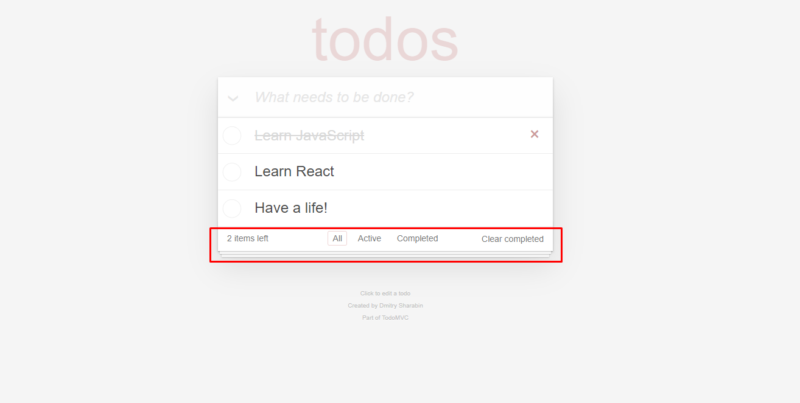

# React ile To Do List Yapımı

- İlk olarak çalışılacak dizinde "create-react-app" komutu çalıştırıldı. Böylece ToDoList React başlangıç dosyalarını oluşturduk.
- Dosya oluşturulma işleminin ardından doğru dosya konumunda olabilmek adına ilk olarak "cd dosya ismi" komutu kullanıldı. Hemen sonrasında da "npm start" ile projeye başlayacağımız localhost'u ayaklandırdık.

## Bu Proje (ToDoList) Hakkında

Proje React'ın components, props, states ve lifecycle yapılarını kullanarak bir görev oluşturma uygulaması yaılması amaçlanmıştır.

## Uygulamayı İnceleyelim

Uygulamamız 3 ana alandan oluşup görev kaldırma, görev ekleme, belli filtreler ışığında (All - Active - Completed) listeleme, tamamlanan görevleri listeden kaldırma ve toplam görev sayısını gösterme gibi birtakım önemli alanları barındırmaktadır.

Footer Alanı Detaylı Görsel:

